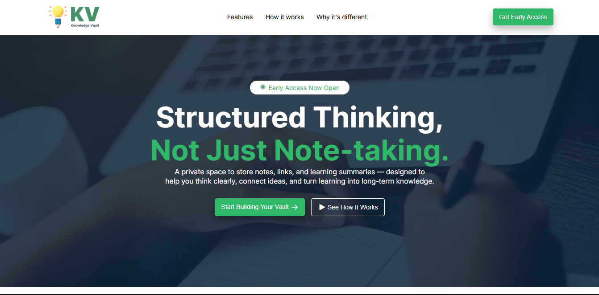

  
  # Knowledge Vault
  
  
  

 

This was the first assignment assigned to me as thepart of the course where I was provided with a Figma file and my goal was to create the UI as identical as possible to the Figma using raw HTML and CSS.

I was successfully able to recreate the UI and achieved max marks for the assignment

Projects Sneakpeak:  

## Technical details

Tech Stack:

<b>Only these languages were allowed and it was only made to test raw HTML and CSS skills except responsiveness.</b>

If you have any suggestions or anything to say related to this project, let me know.